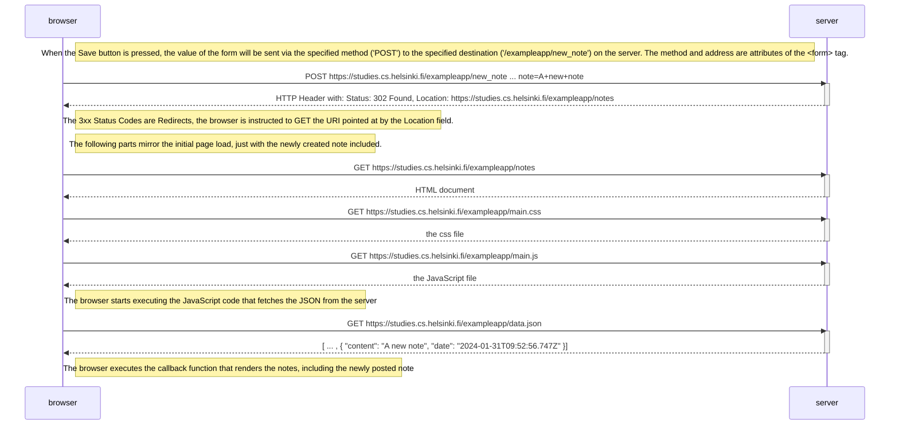

```mermaid
sequenceDiagram
    participant browser
    participant server

    Note right of browser: When the Save button is pressed, the value of the form will be sent via the specified method ('POST') to the specified destination ('/exampleapp/new_note') on the server. The method and address are attributes of the <form> tag.

    browser->>server: POST https://studies.cs.helsinki.fi/exampleapp/new_note ... note=A+new+note
    activate server
    server-->>browser: HTTP Header with: Status: 302 Found, Location: https://studies.cs.helsinki.fi/exampleapp/notes
    deactivate server

    Note right of browser: The 3xx Status Codes are Redirects, the browser is instructed to GET the URI pointed at by the Location field. 
    Note right of browser: The following parts mirror the initial page load, just with the newly created note included.

    browser->>server: GET https://studies.cs.helsinki.fi/exampleapp/notes
    activate server
    server-->>browser: HTML document
    deactivate server

    browser->>server: GET https://studies.cs.helsinki.fi/exampleapp/main.css
    activate server
    server-->>browser: the css file
    deactivate server
    
    browser->>server: GET https://studies.cs.helsinki.fi/exampleapp/main.js
    activate server
    server-->>browser: the JavaScript file
    deactivate server
    
    Note right of browser: The browser starts executing the JavaScript code that fetches the JSON from the server
    
    browser->>server: GET https://studies.cs.helsinki.fi/exampleapp/data.json 
    activate server
    server-->>browser: [ ... , { "content": "A new note", "date": "2024-01-31T09:52:56.747Z" }]
    deactivate server    

    Note right of browser: The browser executes the callback function that renders the notes, including the newly posted note
```